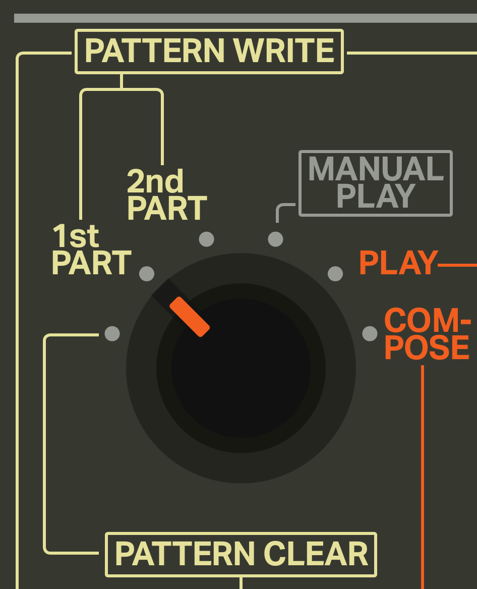
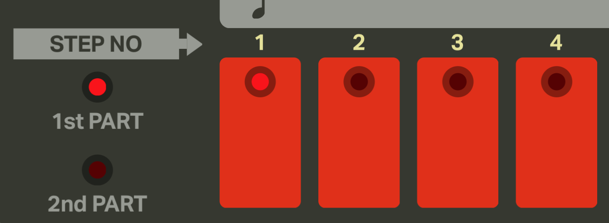

# iO-808 Tutorial

Welcome to the iO-808 tutorial! The primary goal of this webapp is to faithful recreate the functionality of the original TR-808 hardware. Unfortunately if you are unfamiliar with the original hardware, the interface can be difficult to understand. This tutorial should get you quickly up to speed and making your own beats!

## Programming a Pattern

In the 808 there are a total of 12 basic rhythm and 4 fill in patterns that you can store in memory. These patterns are identified by the labels below the step buttons shown here:

Each of these patterns has a first and second part along with an A and B variation which we will talk about next.

### First Part

Lets start programming some patterns.

As a first step we need to turn the mode knob (found at the top-left of the app) to `1st PART`.

You will also want to ensure the basic variation switch is in the `A` position. We will be talking about programming variations in a following section.

If you look at the step buttons you'll notice that one of the lights will be blinking. While the drum machine is stopped the blinking light will identify which of the 16 patterns we are going to be editing. For now lets select the first pattern.
 

### Second Part

### Variations

### Fill-Ins

## Playing Patterns

### Selecting the Starting Pattern

### Starting With an Intro

### Scheduling Patterns

### Adding Fill-Ins

### Using Auto Fill-In

## Clearing Patterns

## Sharing Patterns
